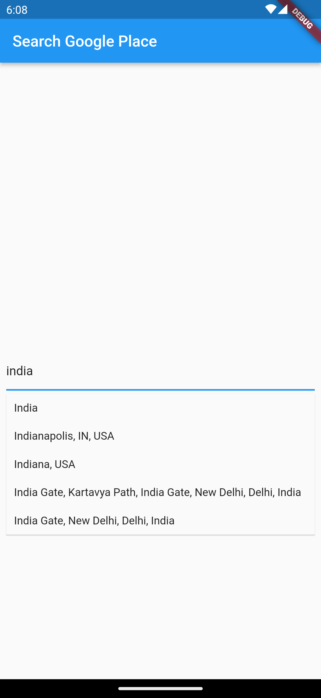

# google_search_place

# Add dependency into pubspec.yml

```
dependencies:
  flutter:
    sdk: flutter
  google_search_place: <last-version>
  
```  

# AutoComplete TextField Widget code

```
              SearchPlaceAutoCompletedTextField(
                    googleAPIKey: "",
                    controller: _searchPlaceController,
                    itmOnTap: (Prediction prediction) {
                      _searchPlaceController.text =
                          prediction.description ?? "";

                      _searchPlaceController.selection =
                          TextSelection.fromPosition(TextPosition(
                              offset: prediction.description?.length ?? 0));
                    },
                    getPlaceDetailWithLatLng: (Prediction prediction) {
                      _searchPlaceController.text =
                          prediction.description ?? "";

                      _searchPlaceController.selection =
                          TextSelection.fromPosition(TextPosition(
                              offset: prediction.description?.length ?? 0));

                      debugPrint("${prediction.lat} ${prediction.lng}");
              })
    
```

# Customization Option

You can customize a text field input decoration and debounce time

# Screenshots

